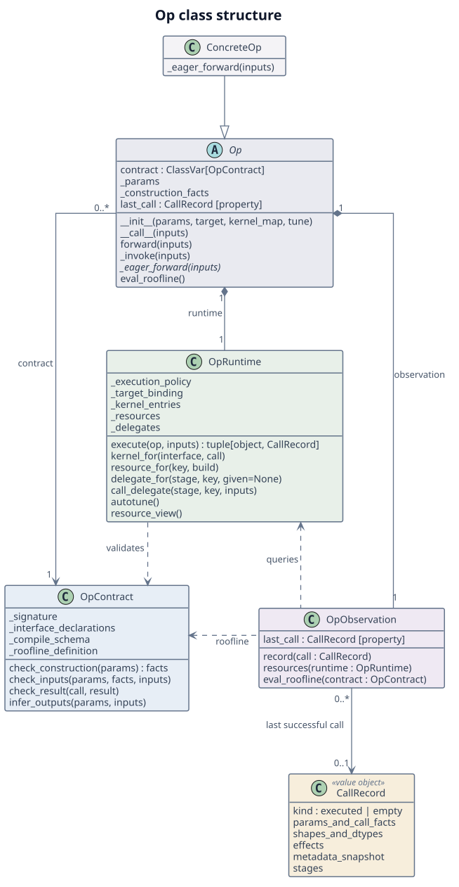

# Op Interface Design

Op responsibilities, lifecycle rules and implementation guide. Interface details: [reference](ops-design-reference.md). Per-slot rules: [op-slot-rules.md](op-slot-rules.md).

## Concepts

Every operator is split into two classes — **Op** (host-side: validates inputs, dispatches to Kernel, assembles output) and **Kernel** (device-side: owns the TileLang program, tile configuration, JIT compilation). The two layers are independently modifiable — changing a Kernel's tile strategy does not require changing the Op.

### Op base responsibilities

The Op layer separates contract, execution runtime and execution observation.

| Responsibility        | Owns                                                                                                | Boundary                                                                        |
| --------------------- | --------------------------------------------------------------------------------------------------- | ------------------------------------------------------------------------------- |
| Op contract           | Parameter rules, input/output rules, effects, shape/dtype inference, interfaces and compile schema. | Defines and checks validity; does not change execution resources.               |
| Execution runtime     | Target binding, kernels, reusable resources, sub-ops, tuning and call lifecycle.                    | Manages execution state and failure recovery; produces successful-call records. |
| Execution observation | Completed-call records, resource queries and roofline analysis.                                     | Reads runtime resources; does not trigger binding, building or tuning.          |

The contract supplies validation rules; the runtime applies them around execution and returns a record after result validation. Target routing selects who serves the whole op; kernel selection chooses an implementation within the built-in path. Both belong to the runtime.

### Class structure



[PlantUML source](diagrams/op-base.puml). Solid diamonds denote composition, a hollow triangle inheritance, solid arrows associations, and dashed arrows dependencies.

Members use Python conventions: `_name` denotes an internal interface, `ClassVar` a class attribute, and `[property]` a property. The italic `_eager_forward()` is an abstract extension hook implemented by subclasses and called by the runtime. These conventions imply no enforced access restriction; `__call__()` is Python's callable protocol.

- `Op` is the public facade. Concrete ops inherit it and supply the built-in computation.
- `OpContract` holds shared definitions for one concrete op class. `Op` holds normalized, immutable `_params` and the derived `_construction_facts` returned by `check_construction()`.
- Each `Op` owns one `OpRuntime` and one `OpObservation`. These components are composed, with no inheritance between them.
- `OpRuntime.execute()` validates and executes the call, returning its result and completed `CallRecord`. It owns caches, sub-ops, tuning and failure recovery.
- `Op._invoke()` passes successful records to `OpObservation`, which queries runtime resources and uses the contract's roofline definition. `CallRecord` is data, and may also be referenced by a parent's stage record.

The runtime does not depend on observation; the facade connects them. Public helpers delegate to the appropriate component. `_eager_forward()` supplies the built-in body; entry adapters determine whether that body runs eagerly or is traced as a composition.

The implementation is organized under `src/tileops/ops/`:

| Module                  | Contents                                                                     |
| ----------------------- | ---------------------------------------------------------------------------- |
| `op_base.py`            | `Op`, public adapters and the computation hook.                              |
| `_op_contract.py`       | `OpContract` and the immutable `CallRecord` data model.                      |
| `_op_runtime.py`        | `OpRuntime`, acquisition, active call scopes and failure cleanup.            |
| `_op_observation.py`    | `OpObservation`, retained records and read-only analysis.                    |
| `_signature_codegen.py` | Generates contract functions and entry adapters; owns no instance state.     |
| `compile_boundary.py`   | Resolves instance handles for custom operators; owns no execution resources. |

Generated checks return facts to their caller instead of assigning attributes on `Op`. The runtime passes checked facts to execution and builds a record only after result validation. Contract and record types do not import runtime or observation.

### Construction and call lifecycle

Concrete constructors normalize parameters, including values supplied by injected collaborators, then pass them to `Op.__init__()` for contract validation. The validated parameters and their derived facts are fixed together; named parameter properties read `_params`. Runtime initialization, delegate wiring and instance registration follow validation; none rewrites semantic parameters. Shared contract caches contain only definitions and generated code.

`Op._invoke()` runs one lifecycle: validate inputs, open a call scope, acquire execution resources, execute, validate results, finalize a record and publish it. The scope closes in `finally`, including on interruption. Signature checks cover shape, dtype and declared effects; metadata-value predicates marked as caller obligations remain caller obligations.

Initial target binding and newly acquired resources remain provisional until the call succeeds. Failure discards that call's provisional state, preserves earlier committed resources and `last_call`, and leaves initial binding retryable. Each child call commits independently: a later parent failure does not undo a completed child. Recovery concerns runtime state; writes already made to caller tensors are not rolled back.

| Entry              | Execution and observation                                                                                                                                                                                                                |
| ------------------ | ---------------------------------------------------------------------------------------------------------------------------------------------------------------------------------------------------------------------------------------- |
| Eager call         | `_invoke()` executes and publishes a checked record. Ops without tensor inputs use their declared device.                                                                                                                                |
| Compile boundary   | Generated `forward()` selects a custom operator; its real body enters `_invoke()` outside tracing.                                                                                                                                       |
| Traced composition | `forward()` exposes the built-in composition and existing child ops. Tracing performs no resource acquisition or record publication; child boundaries record their real executions. No parent execution record is inferred from tracing. |
| Empty call         | If every declared write has zero elements, construct the contract-defined result and publish an `empty` record without binding or building.                                                                                              |
| Meta/fake call     | Infer and validate through the contract, without runtime acquisition or replacing `last_call`.                                                                                                                                           |

A composite requiring whole-op target dispatch or a parent record during compiled execution declares a compile boundary. `_eager_forward()` may be traced only when it is a composition without eager resource acquisition.

### Execution observation

Observation exposes two views:

- **Current resources:** target, built kernels, sub-ops and configurations, queried from the runtime without duplicating its caches.
- **Last successful call:** immutable parameters and checked call facts, shapes, dtypes, effects, metadata and completed stage calls, retained for analysis.

A built kernel need not have run in the latest call. After successful A and B calls, both specializations may be cached while `last_call` describes B. A failed C call leaves that record unchanged; resource rollback is a separate runtime decision.

`CallRecord` is immutable data with a completion kind (`executed` or `empty`). It retains only metadata needed for analysis, captured as stable summaries or private tensor snapshots at the point the effect rules describe. Caller mutation cannot change an earlier record. Capturing GPU metadata does not require converting it to host values on every call; analysis may synchronize when reading it. A record certifies successful dispatch and result validation, not device synchronization or elapsed time.

Stage records contain completed calls in order, attributed to the invocation's stage rather than the child's object identity. A shared child can serve multiple stages. Children used on a different branch contribute no calls to the current record.

Roofline functions belong to the contract and consume the record, including routing metadata and partial writes. A read/write split that cannot be derived is unavailable, rather than estimated by subtracting the full size of a mutated tensor.

`last_call` describes call semantics and completed stage calls. `run_config()` reports instance configuration or the first configured kernel, which may differ from the latest call's configuration. Roofline derives work and theoretical traffic; timing requires separate measurement.

### State and lifecycle rules

| State                                             | Owner and lifetime                                                                               |
| ------------------------------------------------- | ------------------------------------------------------------------------------------------------ |
| Rules and generated functions                     | Shared contract; independent of instance target and resources.                                   |
| Parameters and construction facts                 | `Op`; fixed after construction. Changing semantic parameters creates a new instance.             |
| Target binding and cached entries                 | Runtime; committed resources survive later failed calls. Changing target creates a new instance. |
| Active facts, provisional entries and stage calls | Runtime call scope; always closed, never used as `last_call`.                                    |
| Completed record                                  | Observation; replaced only by a successful real or empty call.                                   |

Queries acquire no resources; views show only entries already held, including children wired at construction. Before the first completed call, `last_call` raises `RuntimeError`. Instance handles are registered lazily after construction succeeds, retain instances weakly and are never reused for another instance.

Tests cover construction consistency, borrowed delegates, failures and interruption, stable records, and cold eager/compile, empty and meta paths.

### Class hierarchy

```
Op                          ← L1: shared host-side infrastructure
  └── FamilyBase            ← L2: shared computation body (optional)
        └── ConcreteOp      ← L3: leaf class emitted by the scaffold
```

- **L1 (`Op`):** coordinates contract, runtime and observation, and exposes the methods generated from the manifest signature, including `_infer_output_shapes`, `_validate_dtypes` and `eval_roofline`.
- **L2 (`FamilyBase`):** per-family shared `_eager_forward()` pipeline (one per family). **Not produced by this playbook** — see [Family-Base Refactoring](#family-base-refactoring).
- **L3 (`ConcreteOp`):** this playbook's target. New ops start by inheriting L1 directly (T2 shape); see [Family-Base Refactoring](#family-base-refactoring) for when a family graduates to L2.

### Execution timing

**Do it at the first moment all required information is known, do it once, cache the result.** What an op knows at construction is its `signature.params`; every index the call's tensors carry is solved per call.

**Shape is not a constructor parameter when the tensors carry it.** Only `signature.params` belongs in `__init__`, plus the code-owned execution-policy parameters of [manifest.md table 7](manifest.md#t-policy). A dimension declared nowhere is not construction information: it arrives with the call, and taking it twice lets an instance disagree with the tensors it is handed. What the kernel is compiled for goes in the memory key instead, so a second shape builds a second kernel.

**Dtype is not a constructor parameter when the inputs determine it.** An op reads it from the input tensors in `forward()`: a caller who passes fp16 tensors gets the fp16 kernel without having said so twice, and an op can no longer be constructed in a state that disagrees with the tensors it is about to be handed.

**An output dtype is a dtype expression of the signature** — a `DType` index solved from the inputs, a constant, a dtype primitive, or a dtype parameter the caller passes at construction ([manifest.md](manifest.md#dtypes)).

Kernel construction is deferred until a call needs a specialization, keyed by every input that selects it, dtype among them. `Op.__init__()` installs the kernel map without building entries or querying a device — see [Kernel selection](#kernel-selection).

The contract supplies dtype checks at real and fake call boundaries; computation bodies repeat none. Traced compositions expose child contracts rather than entering Python lifecycle machinery. Roofline timing and formula semantics are in [roofline.md](roofline.md); see [Parameter Design](ops-design-reference.md#parameter-design) for fixed-rank vs arbitrary-rank details and [Codegen Details](ops-design-reference.md#codegen) for calling conventions.

### Kernel selection

**Construction reads no device property.** Installing the kernel map resolves classes only; a device that cannot run the op is refused when a kernel is first selected, built or called. Why: the tensors arrive later, perhaps on a device the process has not touched.

**A kernel interface is a place an op calls a kernel.** Its class publishes the call contract: the call spec, the tensors handed, what returns, and what `entry_for(call)` owes. An op opens one only where semantics or that contract changes. Why: a backend implements an interface from the contract alone.

**An implementation is a kernel class that inherits an interface, registered under a key.** It is one complete algorithm; tile sizes, split counts and fusion among fixed stages are its plan. Why: it is the unit a backend replaces and selection chooses.

**A call spec holds the immutable facts of one call.** Device facts derive from its device on a miss. Why: equal call specs denote one call, so one resolved entry serves every recurrence.

**Availability filters before selection.** An implementation is available where its `devices` and `supported_archs` allow. Why: where a kernel runs is a fact of the implementation, not of the calls it serves.

**Applicability states the calls an implementation serves, positively.** An op checks no implementation's limits, and the signature holds only what the algorithm requires ([manifest.md § Refinements](manifest.md#refinements)). Why: each implementation answers for itself.

**Precedence picks among the available implementations that apply.** `general` is below every other, and `preferred_over` names the implementations one wins over, transitively and acyclically; no winner is an error, several an ambiguity. Why: a declared relation composes implementations unaware of each other, where order or numeric priority cannot.

**An entry is what `entry_for` builds, shared by build identity.** A hit is one lookup by interface and call spec; a miss selects, then builds or reuses. Tuning acts on the entry. Why: a hit costs one lookup.

**Adding a kernel takes two hooks.** Register the implementation, then state `applies`, adding `preferred_over` only where it overlaps another non-general implementation. Undeclared, an implementation is available on the CUDA devices of every architecture, applies to every call and has no precedence. Why: a single-implementation op only inherits its interface.

Choosing the interface sits above selection, dtype specialization beside it. See [S13](op-slot-rules.md#slot-s13).

### Target boundary

**A target replaces the whole op.** A target that registers a builder for an op serves every call of it, and its kernel is called with the tensors its builder was described with. The op's own body is the in-tree implementation and does not run for a target.

**`kernel_map=` replaces what runs under a key, not the key's rule.** The key keeps its registered implementation's applicability and precedence, and is available wherever either class runs; the replacement, like every implementation, inherits the key's interface and is built through its own `entry_for`; a selected key whose replacement cannot serve the call is an error, never a fallback. Why: what selects a key stays declared in one place, and changing which calls a kernel serves is registration.

**The op layer guarantees a target the manifest, and nothing more.** The generated checks run before the target is called. Every tensor is on the call device except those declaring `device: cpu`, every tensor declaring `contiguous: true` is contiguous, and the call, a caller-supplied output buffer included, meets the signature.

**A traced op is one graph node whichever target serves it.** An op on the [compile boundary](#compile-dispatch-boundary) chooses between the in-tree kernels and a target inside its operator.

**A composite needs no builder of its own.** An op that builds no kernel of its own runs its composition when the target registers no builder for it; each sub-op, given the composite's `target`, settles on a target itself.

**An op with no call-time tensor input is placed by the call-device rule** of [manifest.md § Call Semantics](manifest.md#call-semantics).

### Kernel caching and enumeration

L1 owns get-or-build. An op names the **kernel interface** a kernel serves, and the selected implementation's `entry_for` names the **identity** of the specialization and the factory that builds it. The factory runs on the first miss for that identity and never again. An op MUST NOT carry a get-or-build of its own — no cache dict, no build guarded on a kernel attribute being unset. Holding what L1 returned in `self.kernel` is not one.

The identity is opaque to L1 and must carry every input that can change what gets built. The selected implementation names those axes in its own `entry_for`, because only it knows what its constructor reads.

The entry, not the kernel, is the unit built once. A specialization that must build several kernels together returns them as one immutable entry from one factory; kernels keyed independently of each other are separate interfaces.

Reusable auxiliary tensors, such as RoPE frequency tables, use `resource_for(key, build)`. The key includes their purpose and every varying construction input, including device and dtype. These runtime-owned entries follow the same provisional/committed lifetime as kernels. Implementation-specific scratch buffers and ABI placeholders belong inside the kernel entry. Cached semantic resources are read-only; mutable execution buffers are call-local.

`iter_kernels()` enumerates entries and delegates explicitly, never by reflecting over attributes. Reflection could only guess: a kernel nested deeper than the traversal went, or held in an attribute of an unrecognised type, was silently invisible. Declaring turns that silent omission into a missing declaration.

**Sub-ops follow the rule for kernels.** A sub-op's constructor arguments may come from the call, so an instance built at construction cannot show what a composite holds.

- A composite declares the sub-op classes it may hold in `delegate_types`: its composition is a fact of the class, checkable before any call.
- It holds every sub-op through `delegate_for`, once per stage and identity. Created children inherit the parent's execution policy. Injected children are borrowed: their configuration is checked for compatibility, never overwritten, and parent cleanup never resets them.
- `kernel_delegates()` is derived from what `delegate_for` holds, so enumeration is complete by construction and a composite never overrides `autotune()`.

`delegate_for` is eager, like `kernel_for`: a sub-op that depends on the call is built in `_eager_forward`, never on a traced path.

`call_delegate(stage, key, inputs)` invokes an acquired child with explicit stage attribution. In a traced composition it reduces to the child call without manipulating Python observation state. Non-Op collaborators, such as prepare/finalize strategies, remain ordinary domain objects.

`built_kernels(interface)` is the backend-neutral view: one entry per identity, whoever built it. `iter_kernels()` and `run_config()` can inspect owned and borrowed children. `autotune()` mutates only owned entries and children; callers tune borrowed children explicitly. Support is an entry capability, so an unsupported request reports that outcome without an Op-specific override. A target that cannot receive tuning requests reports the same limitation.

An extra public operation, such as weight repacking, has an explicit contract and target policy. It is either a separate Op using the same lifecycle or an implementation helper tied to its kernel's layout; it does not silently bypass whole-op target selection.

## Scaffolding an Op from a Manifest Entry

The scaffold emits a T2 (L1-direct) op file from one manifest entry. The call checks, `_infer_output_shapes`, `_validate_dtypes` and `eval_roofline` are generated from the entry and are not scaffolded. Each step has typed **Input** (manifest fields consumed), **Output** (the code fragment produced), **Validation** (concrete check), and a **Reference** link to the authoritative slot rule in [`op-slot-rules.md`](op-slot-rules.md). Examples scaffold the fictional `ExampleCumsumFwdOp` (cumulative-sum semantics) in T2 (L1-direct) form from an equally fictional manifest entry; nothing in them mirrors a shipped file.

### Step 1: File header + imports

**Input.** The Kernel classes the op dispatches to, and the family's kernel interfaces. The kernel map is owned by the code, not the manifest.

**Output.**

```python
"""Cumulative sum operator (host-side Op layer).

Provides:
  - ExampleCumsumFwdOp: y = cumsum(x, dim=-1)
"""

from typing import ClassVar, Dict, Mapping, Optional

import torch

from tileops.backend import Target
from tileops.kernels.kernel_base import Kernel, KernelInterface
from tileops.kernels.reduction.call_spec import (
    ExampleCumsumCall,
    ExampleCumsumFwdInterface,
)
from tileops.kernels.reduction.example_cumsum import ExampleCumsumKernel
from tileops.manifest.primitives import normalize_axis
from tileops.ops.op_base import Op
```

**Validation.** Every concrete-Kernel import matches one `kernel_types` value verbatim, and every kernel interface one `interfaces` value. The `Kernel` and `KernelInterface` base imports and the `tileops.ops.op_base` import are fixed.

**Reference.** [Slot S1](op-slot-rules.md#slot-s1), [S2](op-slot-rules.md#slot-s2), [S3](op-slot-rules.md#slot-s3), [S4](op-slot-rules.md#slot-s4).

### Step 2: Class declaration + docstring + `__all__`

**Input.** Manifest entry key (= class name); what the op computes.

**Output.**

```python
__all__ = ["ExampleCumsumFwdOp"]


class ExampleCumsumFwdOp(Op):
    """Cumulative sum operator: y = cumsum(x, dim=-1).

    Output has the same shape and dtype as input.
    """
```

**Validation.** Class name ≡ manifest entry key, byte-exact (`ExampleCumsumFwdOp`). The class docstring has no `Args:` block: construction parameters are documented on `__init__` (Step 3).

**Reference.** [Slot S5](op-slot-rules.md#slot-s5), [S6](op-slot-rules.md#slot-s6), [S7](op-slot-rules.md#slot-s7).

### Step 3: `__init__` signature and body

**Input.** `signature.params`, and the execution-policy parameters of [manifest.md table 7](manifest.md#t-policy) the op takes.

**Output.**

```python
def __init__(
    self,
    dim: int = -1,
    *,
    target: Target = None,
    kernel_map: Optional[Dict[str, Kernel]] = None,
    tune: bool = False,
):
    """Build the op.

    Args:
        dim: Reduction dimension (default -1).
        target: Backend target to serve this op, or None to decide from the input device.
        kernel_map: Optional override for kernel dispatch.
        tune: Whether to autotune (default False).
    """
    super().__init__(
        params={"dim": dim}, target=target, kernel_map=kernel_map, tune=tune
    )
```

**Validation.** Every `__init__` kwarg has an `Args:` entry in its docstring; no extras. `__init__` matches `signature.params` item by item ([manifest.md](manifest.md#parameters)), followed by the table-7 execution-policy parameters it takes. `dtype` is not a kwarg — it is read from the input in `forward()`. A param declaring `kw_only: true` goes after `*`.

**Reference.** [Slot S12](op-slot-rules.md#slot-s12), [S13](op-slot-rules.md#slot-s13).

### Step 4: `kernel_types` + `interfaces` + `_eager_forward`

**Input.** `signature.inputs`; the kernels and kernel interfaces of Step 1.

**Optional inputs.** An `optional: true` input takes a `None` default in `_eager_forward` and the generated public adapter. Presence is read from the call rather than settled at construction. Where presence changes what gets built, it belongs in the kernel cache key alongside the shapes.

**Output.**

```python
class ExampleCumsumFwdOp(Op):
    kernel_types: ClassVar[Mapping[str, type[Kernel]]] = {
        "example_cumsum_fwd": ExampleCumsumKernel
    }
    interfaces: ClassVar[Mapping[str, type[KernelInterface]]] = {
        "example_cumsum_fwd": ExampleCumsumFwdInterface
    }

    def _eager_forward(self, x: torch.Tensor) -> torch.Tensor:
        # The generated signature checks have run: dtype, shape, dim range.
        dim = normalize_axis(self.dim, x.ndim)
        x = x.contiguous()  # handed over as the manifest declares it
        call = ExampleCumsumCall(
            device=x.device, shape=tuple(x.shape), dim=dim, dtype=x.dtype
        )
        return self.kernel_for("example_cumsum_fwd", call)(x)
```

**Validation.**

- `_eager_forward` repeats no check the signature states. It checks no device kind: a kernel states which devices it runs on.
- The kernel comes from `self.kernel_for`, never a cache dict the op owns:
  - The call spec carries `x.dtype`, so a call with another dtype resolves a second entry rather than reusing the first. The implementation's own `entry_for` names what it is built from; the op defines none.
- The op never trims kernel output, and never reshapes its input for the kernel: a kernel that pads or permutes internally takes and returns the shapes the manifest declares.

**Reference.** [Slot S14](op-slot-rules.md#slot-s14), [S15](op-slot-rules.md#slot-s15), [S16](op-slot-rules.md#slot-s16).

### Step 5: Generated methods

**Input.** The whole entry.

**Output.** Nothing to write. `_infer_output_shapes`, `_validate_dtypes`, the call checks around `forward` and `eval_roofline` are generated from the signature and the `roofline` field; see [manifest.md § Call Semantics](manifest.md#call-semantics) and [roofline.md §4.4](roofline.md#44-op-codegen).

**Validation.** `python scripts/validate_manifest.py`.

**Reference.** [Slot S17](op-slot-rules.md#slot-s17), [S18](op-slot-rules.md#slot-s18), [S19](op-slot-rules.md#slot-s19).

**Compute roof.** The contract's roofline definition includes a function of `CallRecord` naming the GPU-profile unit; the default is `"cuda_core.fp32"`. Matmul definitions select `tensor_core_roof` from the recorded contraction dtype. `Op.compute_roof()` and `eval_roofline()` delegate to observation; metric functions read no mutable instance state. Formula semantics: [`roofline.md §1.4`](roofline.md#14-compute-roof).

### Step 6: Package registration

**Input.** The class name (Step 2) and the op's source filename.

**Output.** Two files, both with a matching `__all__` entry.

Implementation package, `src/tileops/ops/reduction/__init__.py`:

```python
# --- ExampleCumsumKernel ops ---
from tileops.ops.reduction.example_cumsum import ExampleCumsumFwdOp
```

Public path, `src/tileops/reduction.py` — this is the one callers import from:

```python
from tileops.ops.reduction import ExampleCumsumFwdOp
```

**Validation.** The implementation import sits under its family's grouping comment block, and both files carry a matching `__all__` entry — miss the second and the op is unreachable from `tileops.reduction`.

**Reference.** [Slot S20](op-slot-rules.md#slot-s20).

### Slot coverage

| Step | Slots produced |
| ---- | -------------- |
| 1    | S1, S2, S3, S4 |
| 2    | S5, S6, S7     |
| 3    | S12, S13       |
| 4    | S14, S15, S16  |
| 5    | S17, S18, S19  |
| 6    | S20            |

## Out of Scope

This playbook emits exactly the 16 slots above. The following are **not** produced by the scaffold — each needs separate treatment:

- **Family-specific protocol variables and hooks.** `_op_kind`, and the hooks of [Optional Hooks (Appendix)](ops-design-reference.md#optional-hooks-appendix) (reduction). Kernel-dispatch-convention-dependent; cannot be mechanically derived from the manifest. See [Family-Base Protocol (Appendix)](ops-design-reference.md#base-class-protocol).
- **Family-base (T1) subclassing.** See [Family-Base Refactoring](#family-base-refactoring).
- **Kernel implementations themselves.** The playbook's scope is the Op (host) layer. See [Implementing a Kernel](#implementing-a-kernel) for the kernel-side interface surface.
- **`fullgraph` compile registration.** Declaring a compile boundary is the class's claim that it supports `fullgraph=True`; its cold compile test, registered in `tests/compile_contract.py`, is the evidence, and the registered set equals the implemented classes declaring a boundary.
- **Compile dispatch boundary.** See [Compile Dispatch Boundary](#compile-dispatch-boundary).

## Implementing a Kernel

Kernel implementation is not covered by this playbook. The device-side interface a scaffolded Op depends on — the kernel interface's `forward` and the classmethod `entry_for`, required `kernel`, optional `default_config` / `autotune_configs` / `supported_archs` — is specified in [Kernel base class attributes](ops-design-reference.md#base-class-protocol).

## Compile Dispatch Boundary

Contract for every op registered for `fullgraph=True` compilation while resolving kernels at call time.

**Invariant.** A dynamo-traced `forward` MUST NOT construct a `Kernel` or enter a TileLang builder. Kernel-cache misses run TileLang JIT machinery that dynamo cannot trace; an eager warm-up before `torch.compile` only hides the miss path and does not satisfy the cold-call contract.

**Decisions.**

- A class declaring `compile_boundary = True` claims `fullgraph=True` support. The manifest records nothing; the registered compile tests are the evidence, and their set equals the implemented classes declaring a boundary.
- The operators are generated from the manifest entry, one `torch.library.custom_op` per effect branch ([manifest.md § Effects](manifest.md#effects)), so no op writes registration code and a schema cannot drift from its entry. The operator is what makes the graph node this op's, and it stays the same node when a target serves the op.
- Generated `forward` chooses which operator to call. Its real body enters `_invoke()` for validation, target dispatch and recording; its fake uses only the contract and never publishes an execution record.
- An op's operators write exactly the inputs the manifest marks `mutated`; the validator holds them equal.
- The operator's name is derived from the family and the class; an op does not choose it.
- The boundary covers forward-only compilation. No operator carries an autograd formula, so a backward op's operator refuses an input that tracks history; a caller that needs to backpropagate wires its own `torch.autograd.Function` around the forward and backward ops.
- An op with no tensor input has no node to own and registers no boundary. An op that builds no kernel in `forward` does not need the boundary; the invariant still applies to it.

## Family-Base Refactoring

The scaffold emits T2 (L1-direct) ops only; once a family accumulates 2-3 ops sharing an identical `_eager_forward()` flow, a separate family-specific refactoring, outside this playbook, extracts an L2 base and rewrites the concrete ops as T1 thin wrappers — see [Development Path](ops-design-reference.md#development-path) for when to extract and [Adding a New Family Base](ops-design-reference.md#adding-a-new-family-base) for the process. Family bases MUST NOT normalize genuine per-op behavior differences.

## Further Reference

- [Slot Rules](op-slot-rules.md) — full Rule / Derivation / Example / Common mistakes per slot
- [Codegen Details](ops-design-reference.md#codegen) — calling conventions, consistency enforcement
- [Base Class Protocol](ops-design-reference.md#base-class-protocol) — `Op` and `Kernel` base class attributes
- [Naming Conventions](ops-design-reference.md#naming-conventions) — class / `kernel_map` / builder function rules
- [Parameter Design](ops-design-reference.md#parameter-design) — construction time versus call time
- [manifest.md](manifest.md) — manifest entry structure, signature, workloads, call semantics
- [roofline.md](roofline.md) — roofline formula syntax, codegen, evaluator surface boundary
